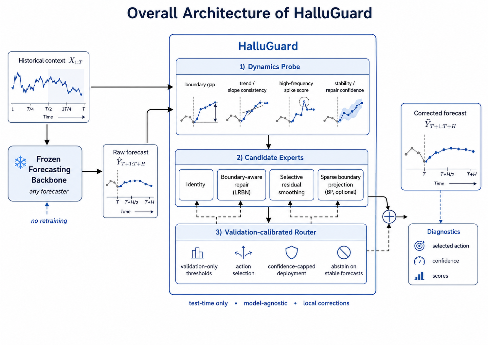
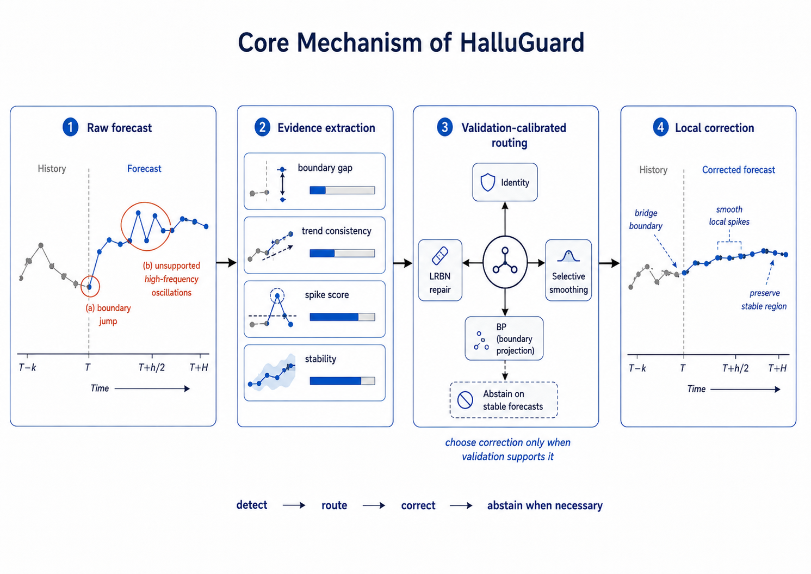

# HalluGuard-SRA-BP

This repository contains the consolidated HalluGuard-SRA-BP release line.

The retained method family is **Sparse Repair-Aware Boundary Projection (SRA-BP)** on top of HalluGuard-LRBN forecasts. Two validation-only calibrated variants are kept:

- `Balanced-SRA`: stronger correction, higher coverage, better compact MSE.
- `Safe-SRA`: more conservative correction, lower harm.

Earlier exploratory lines are intentionally not included as main methods here. They are useful research history, but the current clean SRA-BP line is the compact, auditable boundary-repair method.

## Visual Overview



The architecture view shows HalluGuard as a black-box, test-time layer placed after a frozen forecasting backbone. The core contract is deliberately conservative: HalluGuard reads the historical context and raw forecast, extracts local dynamics evidence, then chooses among identity, LRBN-style boundary repair, selective smoothing, and optional sparse boundary projection. All thresholds and routing policies are calibrated on validation data; test windows are only evaluated.



The mechanism view highlights why the retained SRA-BP line focuses on boundary repair. The method looks for forecast-start discontinuities and unsupported oscillations, routes only when validation evidence supports a correction, and abstains on stable forecasts. In the current release, the main deployable variants are `Safe-SRA` and `Balanced-SRA`: `Safe-SRA` prioritizes harm control, while `Balanced-SRA` exposes more sparse repair coverage for stronger compact MSE gains.

## Method Summary

SRA-BP is an inference-time / post-processing method. It does not retrain the forecasting backbone and does not use hidden states.

For each forecast window, SRA-BP checks whether the LRBN prediction still has an abnormal boundary gap relative to the context tail and whether LRBN has not already repaired that gap sufficiently. If the sample passes the validation-calibrated sparse gate, SRA-BP applies a short decaying bridge from the forecast start toward a context-derived anchor.

The two retained policies are:

```json
Safe-SRA:
{
  "method_family": "short",
  "anchor_mode": "last",
  "tail_len": 16,
  "tau_g": 5.265299801054961,
  "tau_r": 0.8,
  "tau_j": null,
  "alpha": 0.75,
  "K": "H_div_4",
  "continuous": false
}

Balanced-SRA:
{
  "method_family": "support",
  "anchor_mode": "last",
  "tail_len": 16,
  "tau_g": 2.4260872328869336,
  "tau_r": 0.8,
  "tau_j": 0.3,
  "alpha": 0.75,
  "K": "H_div_4",
  "continuous": false
}
```

See [HALLUGUARD_SRA_BP.md](HALLUGUARD_SRA_BP.md) for the detailed mechanism and validation notes.

## Compact Validation Result

The included compact validation fixture covers:

- datasets: `ETTm1`, `ETTh1`
- backbones: `DLinear`, `PatchTST`
- horizons: `96`, `192`
- seed: `2026`
- split contract: validation only for thresholds, test only for final evaluation

Key test results versus HalluGuard-LRBN:

| Variant | MSE | MAE | MSE delta vs LRBN | Harm rate | Coverage | Test leakage |
| --- | ---: | ---: | ---: | ---: | ---: | --- |
| Safe-SRA | 4.813149 | 1.660950 | -1.655217% | 0.035156 | 0.187500 | false |
| Balanced-SRA | 4.766983 | 1.645627 | -2.598508% | 0.104167 | 0.436198 | false |

Full artifacts are under:

```text
experiments/halluguard/results/lrbn_sra_bp_stage5/
```

## Installation

```bash
conda create -n halluguard-sra python=3.10 -y
conda activate halluguard-sra
pip install -r requirements.txt
```

The compact validation fixture is included, so no external download is needed to reproduce the Stage5 SRA-BP validation.

## Reproduce Compact Validation

From the repository root:

```bash
bash scripts/run_sra_bp_compact_validation.sh
```

Equivalent Python command:

```bash
python experiments/halluguard/run_stage5_sra_bp.py \
  --metrics-csv experiments/halluguard/results/research_direction_validation/forecast_inputs/combined_metrics.csv \
  --stage3-dir experiments/halluguard/results/lrbn_bp_stage3 \
  --stage4-dir experiments/halluguard/results/lrbn_bp_stage4 \
  --stage45-dir experiments/halluguard/results/lrbn_bp_attribution_stage45 \
  --output-dir experiments/halluguard/results/lrbn_sra_bp_stage5_repro \
  --n-bootstrap 2000
```

## Core Files

```text
experiments/halluguard/halluguard_sra_bp.py
experiments/halluguard/halluguard_lrbn_bp.py
experiments/halluguard/halluguard_stage4_bp_harm_control.py
experiments/halluguard/run_stage5_sra_bp.py
scripts/run_sra_bp_compact_validation.sh
```

Historical validation scripts retained for audit:

```text
experiments/halluguard/run_lrbn_bp_validation.py
experiments/halluguard/run_stage4_bp_harm_control.py
experiments/halluguard/run_bp_attribution_stage45.py
```

## Programmatic Use

```python
import numpy as np
from halluguard_sra_bp import SRABPParams, apply_sra_bp

params = SRABPParams(
    method_family="support",
    anchor_mode="last",
    tail_len=16,
    tau_g=2.4260872328869336,
    tau_r=0.8,
    tau_j=0.3,
    alpha=0.75,
    K="H_div_4",
)

y_corrected, aux = apply_sra_bp(
    context=context,      # [N, L, C]
    y_raw=raw_pred,       # [N, H, C]
    y_lrbn=lrbn_pred,     # [N, H, C]
    horizons=horizons,    # [N]
    params=params,
)
```

Use `Safe-SRA` when harm control is the priority; use `Balanced-SRA` when compact MSE improvement is the priority.
