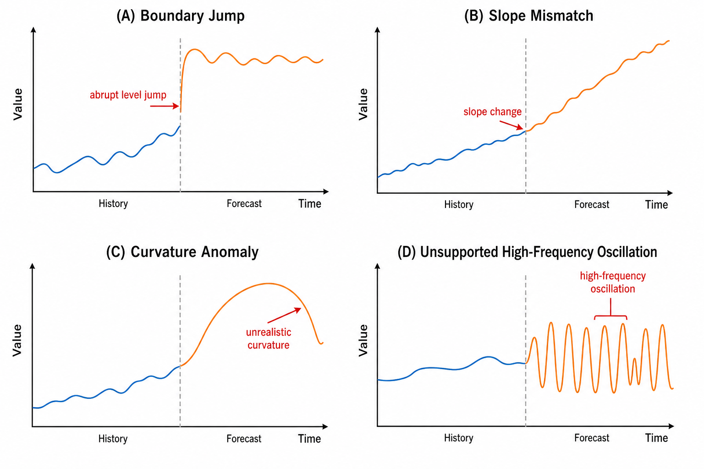
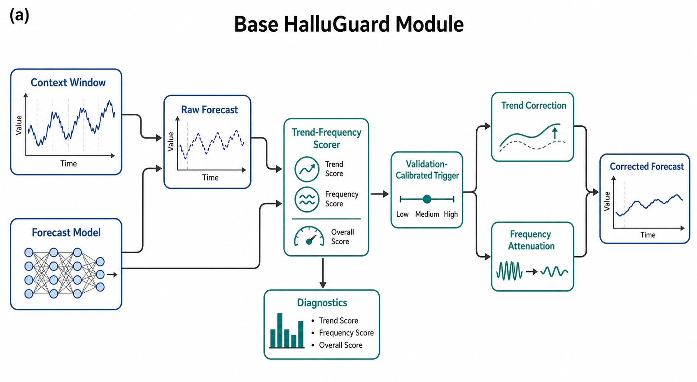
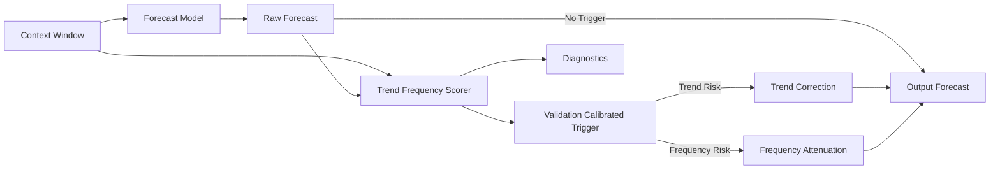
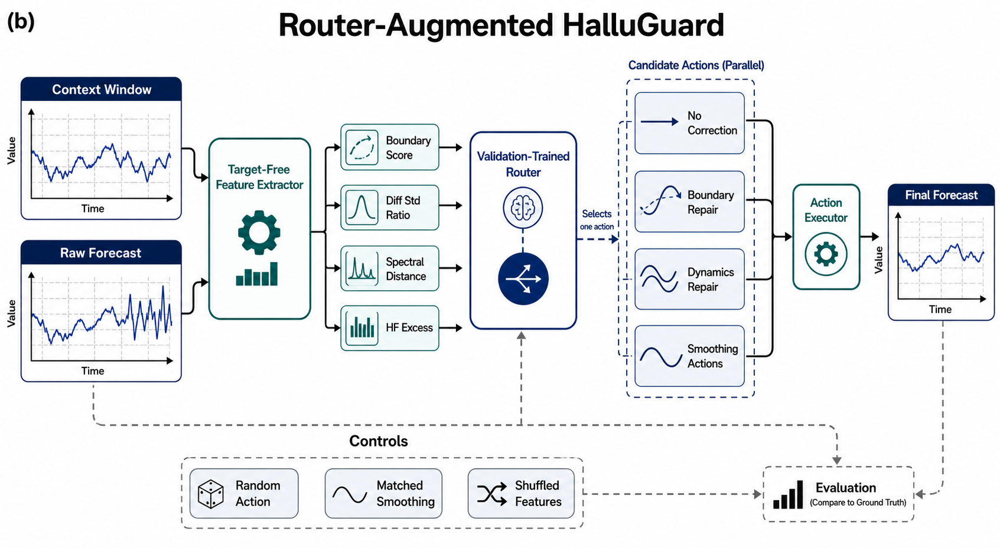
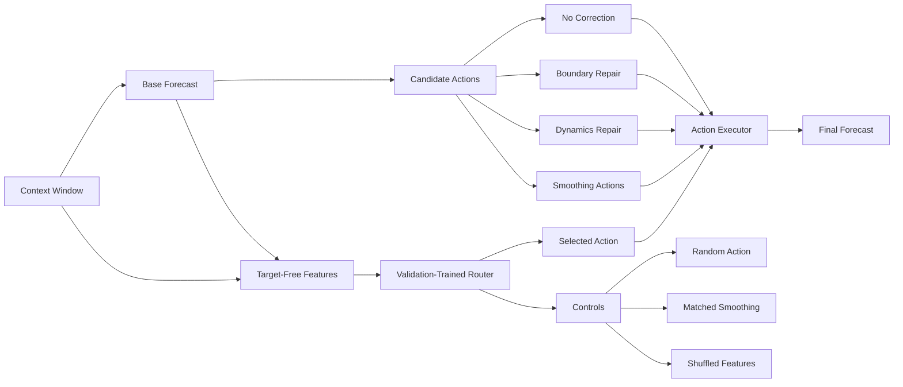
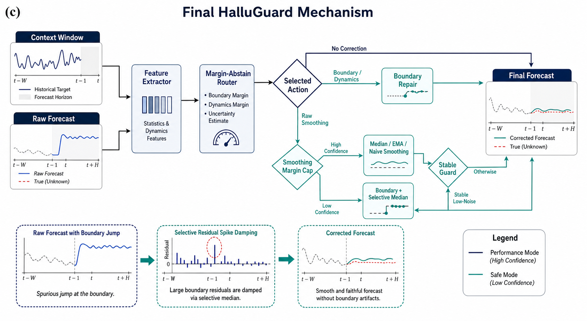
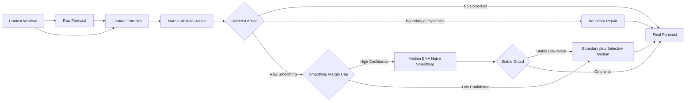

# HalluGuard Research Narrative

本文档从研究动机、文献 gap、方法演进、实验结果和关键代码实现几个角度，梳理 HalluGuard 当前原型的研究路线。文中结果来自本地原型实验，适合作为阶段性项目说明，不应被解读为已经完成的大规模外部泛化结论。

## 1. Motivation and Literature Gap

长期时间序列预测已经有大量强模型和强 baseline：PatchTST 通过 patching 和 channel-independence 改善 Transformer 在长序列预测上的表现；DLinear 说明很多标准 LTSF benchmark 上简单线性分解模型仍然非常强，提醒后续方法必须和强 baseline 对照；Autoformer 和 FEDformer 分别从趋势/季节分解、频域增强角度建模长期依赖；RevIN 和 Non-stationary Transformers 关注分布漂移、非平稳性和归一化/去平稳化问题；TENT 代表了一类 test-time adaptation 方法，但通常需要访问模型参数和梯度。

这些工作留下了一个很实际的空隙：当一个已经训练好的预测模型输出 forecast 之后，平均误差可能处于可接受范围，局部动态仍可能出现边界跳变、斜率衔接错误、曲率变化异常，或者近期上下文不支持的高频波动。现有方法很少提供轻量、模型无关、无需重训的输出层 guard 来处理这类 forecast-level failure。

HalluGuard 面向这个 gap：它在 test time 接收 recent context 和 raw forecast，判断 forecast 是否出现局部动态风险，并在验证集校准过的条件下做小幅 correction。它作为 DLinear、PatchTST 或其他 forecasting backbone 之后的 output guard 工作，不更新模型内部参数。这个想法最初来自三条线索：

- 时间序列分解和频域建模文献说明，趋势和频率结构对预测质量很关键。
- 分布漂移和 test-time adaptation 文献说明，test-time 的输入/输出环境确实可能需要额外校正。
- 强 baseline 文献提醒，如果 correction 只是变成 naive smoothing，就没有足够机制价值，所以必须持续和 random trigger、matched smoothing 等控制组比较。

参考论文：

- PatchTST: [A Time Series is Worth 64 Words: Long-term Forecasting with Transformers](https://arxiv.org/abs/2211.14730)
- DLinear: [Are Transformers Effective for Time Series Forecasting?](https://arxiv.org/abs/2205.13504)
- Autoformer: [Decomposition Transformers with Auto-Correlation for Long-Term Series Forecasting](https://arxiv.org/abs/2106.13008)
- FEDformer: [Frequency Enhanced Decomposed Transformer for Long-term Series Forecasting](https://arxiv.org/abs/2201.12740)
- RevIN: [Reversible Instance Normalization for Accurate Time-Series Forecasting against Distribution Shift](https://openreview.net/forum?id=cGDAkQo1C0p)
- Non-stationary Transformers: [Exploring the Stationarity in Time Series Forecasting](https://arxiv.org/abs/2205.14415)
- TENT: [Fully Test-Time Adaptation by Entropy Minimization](https://arxiv.org/abs/2006.10726)

## 2. Research Path

### 2.1 First module: trend-frequency correction

最早的 HalluGuard 版本把 forecast 的异常理解为两类：趋势异常和频率异常。实现上，它比较 context 与 prediction 的 slope、高频能量占比、谱距离和 roughness，然后用验证集分位数阈值触发 trend correction 或 frequency correction。

这一版验证了一个基本事实：forecast 后处理可以在部分配置上降低误差，而且可以做到不接触模型内部参数。完整 clean table 也暴露出问题：趋势/频率 trigger 和随机 trigger 的差距不稳定，naive smoothing 在纯 MSE 上经常更强。原始 idea 有价值，但“趋势/频率 hallucination”作为机制表述还不够稳定。

### 2.2 Dynamics version: boundary and local continuity

后续实验把问题从“趋势/频率异常”收窄为“forecast 边界和局部动态连续性异常”。新的 HalluGuard-Dynamics 转向三个更局部的量：

- forecast 第一个点相对 context last point + last diff 的 boundary jump；
- forecast 起始一阶差分相对 context 末端差分的 gap；
- forecast 起始曲率相对 context 尾部曲率的 gap。

修正向量也从全局滤波变成局部衰减式修复：边界修正最强，沿 horizon 指数衰减；一阶差分和曲率修复用更平滑的 horizon 权重。该设计把修正集中在预测起点附近，优先处理 forecast 与历史上下文衔接失败的问题。

这一线取得了第一个稳定结果：clean full table 上 HalluGuard-Dynamics 达到约 `-0.623%` MSE delta，15/16 配置改善，beats random 15/16，paired win 0.9375；stress suite 中 boundary discontinuity 明确受益。这说明模块本身确实有用，但仍然不能宣称它优于所有 smoothing baseline，因为在纯点误差目标上 naive/EMA/median smoothing 仍有优势。

### 2.3 Router version: from one correction to action selection

单一 correction 的局限是，不同 forecast 错误需要不同动作。有些样本需要 no correction，有些需要 boundary repair，有些需要 smoothing，但直接全局 smoothing 又可能抹掉真实转折。因此下一步加入 validation-only router，把 HalluGuard-Dynamics 变成一个 action selection module。

Router 的输入特征全部是 target-free 的 forecast/context 特征，包括 boundary score、first-diff score、curvature score、high-frequency excess、spectral distance、prediction/context variance ratio、diff std ratio、context volatility 和 horizon。训练时只在 validation split 上比较各 action 的真实误差，给每个样本打上 best safe action label；测试时只用特征做路由，不看 test target。

第一版 adaptive router 的 clean mean MSE delta 从 `-0.623%` 推到 `-1.289%`，stress mean 到 `-1.391%`，并且 beats random action 15/16。该结果说明 router 能利用局部特征选择更合适的修正动作，收益超过固定 action 或随机 action 的解释。

### 2.4 Mechanism search: selective repair and smoothing cap

自动迭代阶段围绕失败模式设计新机制，并用 clean、stress、external harm diagnostic 三类表进行筛选。关键发现有三类：

- 纯 signal-preserve 或直接减少 smoothing action 会削弱 clean/stress 效果，说明 smoothing 类动作仍有价值。
- 直接使用 raw smoothing 会带来 external PatchTST harm 风险，说明 smoothing 必须被限制。
- `boundary_then_selective_median` 是一个有效新动作：先做 boundary repair，再只对 context 不支持的 residual spike 做局部 median damping。

最终最强 clean/stress 主机制是 smoothing-cap selective router：先用 margin-abstain router 做 action selection；如果 router 选择了 raw smoothing 但置信 margin 不够，就 fallback 到 `boundary_then_selective_median`。这保留 smoothing 的收益，同时减少低置信 smoothing 的过度修正。

同时，stable smoothing-cap guard 能进一步降低 external PatchTST harm：当 prediction 已经很稳定、diff std ratio 低时，对 raw smoothing 触发 stable veto，并 fallback 到 selective repair。它在 external fixture 上把 PatchTST harmed configs 从 4/8 降到 0/8，同时 clean/stress 稍弱，因此当前定位为 harm-diagnostic variant；主 clean/stress snapshot 仍采用 smoothing-cap selective router。

## 3. Mechanism Formulas

下图给出 HalluGuard 关注的四类局部预测异常形态：boundary jump、slope mismatch、curvature anomaly，以及 unsupported high-frequency oscillation。

下面公式对应三张架构图中的三个阶段。记 recent context 为 $x_{1:L}$，raw forecast 为 $\hat y_{1:H}$，target 为 $y_{1:H}$，context scale 为 $\sigma_x=\mathrm{std}(x_{1:L})+\epsilon$。所有阈值只从 validation split 估计，test split 只用于最终评价。

### 3.1 Base HalluGuard: trend-frequency scoring and correction

第一阶段把 forecast-level risk 写成趋势偏移和频率偏移。设 $\beta(z)$ 表示序列 $z$ 的 OLS slope，$\mathcal{F(z)}_k$ 表示离散傅里叶系数，$k_c$ 是高频 cutoff。趋势风险为

$$
s_{\mathrm{trend}}(\hat y, x)=\frac{H\cdot |\beta(\hat y)-\beta(x)|}{\sigma_x}.
$$

高频能量占比定义为

$$
r_{\mathrm{hf}}(z)=
\frac{\sum_{k\ge k_c}|\mathcal{F}(z)_k|^2}
{\sum_{k}|\mathcal{F}(z)_k|^2+\epsilon}.
$$

设 $p(z)$ 为归一化频谱功率，频谱距离为

$$
d_{\mathrm{spec}}(\hat y,x)=\frac{1}{K}\sum_{k=1}^{K}|p(\hat y)_k-p(x_{\mathrm{tail}})_k|.
$$

频率风险采用高频 excess 与频谱距离的组合：

$$
s_{\mathrm{freq}}(\hat y,x)=
\max(0,r_{\mathrm{hf}}(\hat y)-r_{\mathrm{hf}}(x_{\mathrm{tail}}))
+\lambda_{\mathrm{spec}}d_{\mathrm{spec}}(\hat y,x).
$$

validation split 给出分位数阈值

$$
\tau_{\mathrm{trend}}=Q_q(\{s_{\mathrm{trend}}^{(i)}\}_{i\in\mathrm{val}}),
\quad
\tau_{\mathrm{freq}}=Q_q(\{s_{\mathrm{freq}}^{(i)}\}_{i\in\mathrm{val}}).
$$

当 $s_{\mathrm{trend}}>\tau_{\mathrm{trend}}$ 时执行趋势修正：

$$
\tilde y_t
=\hat y_t-\lambda_{\mathrm{trend}}\big(\beta(\hat y)-\beta(x)\big)
\left(t-\frac{H+1}{2}\right),
\quad t=1,\ldots,H,
$$

并用 $\rho\sigma_x$ 对最大调整幅度做 clipping。频率修正在频域执行：

$$
\tilde Y_k=
\left(1-\lambda_{\mathrm{freq}}\mathbf{1}[k\ge k_c]\right)\hat Y_k,
\quad
\tilde y=\mathcal{F}^{-1}(\tilde Y).
$$

该阶段的核心假设是：当 forecast 的 slope 或 high-frequency structure 明显偏离 recent context 时，小幅输出修正可以降低局部动态错误。

### 3.2 Router-Augmented HalluGuard: local dynamics and action selection

第二阶段把 risk 从全局趋势/频率转向 forecast 起点附近的局部连续性。记

$$
\Delta x_L=x_L-x_{L-1}, \quad \Delta \hat y_1=\hat y_2-\hat y_1.
$$

边界跳变、一阶差分 gap 和曲率 gap 分别为

$$
b=\hat y_1-(x_L+\Delta x_L),
$$

$$
g_1=\Delta \hat y_1-\Delta x_L,
$$

$$
g_2=
\mathrm{mean}(\Delta^2\hat y_{1:h})
-
\mathrm{mean}(\Delta^2x_{L-h+1:L}).
$$

局部动态风险 score 为

$$
s_{\mathrm{dyn}}
=\frac{|b|}{\sigma_x}
+\frac{1}{2}\frac{|g_1|}{\sigma_x}
+\frac{1}{4}\frac{|g_2|}{\sigma_x}.
$$

对应的 boundary/dynamics correction vector 使用 horizon 衰减：

$$
u_t=\frac{t-1}{H-1},\quad d_t=\exp\left(-\frac{t-1}{\rho}\right),
$$

$$
v_t=-b\,d_t-g_1\,u_t d_t-g_2\,u_t^2 d_t,
\quad
\tilde y_t=\hat y_t+\alpha v_t.
$$

Router 把多个 action 放入集合

$$
\mathcal{A}=\{\mathrm{no\_correction},\mathrm{boundary},\mathrm{dynamics},
\mathrm{median},\mathrm{ema},\mathrm{selective}\}.
$$

对 validation 样本 $i$，每个 action 的 loss 为

$$
\ell_i(a)=\mathrm{MSE}\big(a(\hat y_i,x_i),y_i\big).
$$

validation label 由最低安全误差 action 给出：

$$
a_i^\star=\arg\min_{a\in\mathcal{A}_{\mathrm{safe}}}\ell_i(a).
$$

Router 的输入特征为 target-free 向量 $\phi_i$，包括 $s_{\mathrm{dyn}}$、boundary score、diff std ratio、spectral distance、high-frequency excess、variance ratio 等。标准化后得到 $z_i$，logistic router 输出

$$
p(a\mid \phi_i)=
\mathrm{softmax}\left(W[1;z_i]\right)_a.
$$

预测阶段选择

$$
\hat a_i=\arg\max_{a\in\mathcal{A}}p(a\mid \phi_i),
\quad
\tilde y_i=\hat a_i(\hat y_i,x_i).
$$

为避免 router 退化成单一动作，实验中同步评价 random-action router、matched-smoothing control 和 shuffled-feature router。只有当主 router 同时优于这些控制组时，action selection 才被视为有机制贡献。

### 3.3 Final Mechanism: smoothing cap and selective fallback

第三阶段聚焦 raw smoothing 的收益/伤害 tradeoff。核心动作 `boundary_then_selective_median` 先应用 boundary repair，得到 $y^{b}$，再只处理 context 不支持的 residual spike。设

$$
m_t=\mathrm{MedianWindow}(y^b)_t,
\quad
r_t=y^b_t-m_t.
$$

用 context tail 估计可接受 residual scale：

$$
\tau_r=
Q_q\left(
\left|x_{\mathrm{tail}}-\mathrm{MedianWindow}(x_{\mathrm{tail}})\right|
\right).
$$

局部 spike mask 为

$$
M_t=\mathbf{1}(|r_t|>\tau_r),
$$

实现中会把相邻点并入 mask，避免单点修正造成新的尖峰。选择性 median damping 为

$$
\tilde y_t
=y^b_t+\gamma M_t(m_t-y^b_t).
$$

最终 router 先得到 action probability $p(a\mid\phi)$。令 $p_{(1)}$ 和 $p_{(2)}$ 为最大和第二大 action probability，margin 为

$$
\mu=p_{(1)}-p_{(2)}.
$$

为避免公式过长，记
$a_{\mathrm{bsm}}=\operatorname{BTM}$ 表示 `boundary_then_selective_median`，
$\mathcal{A}^{\mathrm{smooth}}$ 表示 raw smoothing action 集合。如果 router 选择
raw smoothing action $a\in\mathcal{A}^{\mathrm{smooth}}$，但
$\mu\lt\tau_{\mathrm{cap}}$，则触发 smoothing confidence cap：

$$
C_{\mathrm{cap}}=
\left(a\in\mathcal{A}^{\mathrm{smooth}}\right)\land
\left(\mu\lt\tau_{\mathrm{cap}}\right),
\quad
\hat a=
\begin{aligned}[t]
&a_{\mathrm{bsm}}, && \text{if } C_{\mathrm{cap}},\\
&a, && \text{otherwise.}
\end{aligned}
$$

stable guard 使用 forecast 与 context 的一阶差分波动比：

$$
\rho_{\Delta}=
\frac{\mathrm{std}(\Delta \hat y)+\epsilon}
{\mathrm{std}(\Delta x_{\mathrm{tail}})+\epsilon}.
$$

当 raw smoothing 被选中且 $\rho_{\Delta}\lt\tau_{\mathrm{stable}}$ 时，预测已经较稳定，继续 smoothing 更容易造成过修正。safe variant 将这类样本改派到 selective fallback：

$$
C_{\mathrm{safe}}=
\left(a\in\mathcal{A}^{\mathrm{smooth}}\right)\land
\left(\rho_{\Delta}\lt\tau_{\mathrm{stable}}\right),
\quad
\hat a_{\mathrm{safe}}=
\begin{aligned}[t]
&a_{\mathrm{bsm}}, && \text{if } C_{\mathrm{safe}},\\
&\hat a, && \text{otherwise.}
\end{aligned}
$$

conditional stable-cap variant 还加入 unsupported-noise score $u(\phi)$，只在稳定且 unsupported noise 低的情况下触发 veto：

$$
C_{\mathrm{cond}}=
\left(a\in\mathcal{A}^{\mathrm{smooth}}\right)\land
\left(\rho_{\Delta}\lt\tau_{\mathrm{stable}}\right)\land
\left(u(\phi)\leq\tau_{\mathrm{u}}\right),
\quad
\hat a_{\mathrm{cond}}=
\begin{aligned}[t]
&a_{\mathrm{bsm}}, && \text{if } C_{\mathrm{cond}},\\
&\hat a, && \text{otherwise.}
\end{aligned}
$$

这一阶段的机制含义更明确：raw smoothing 保留为高收益动作；低置信或低噪声支撑的 smoothing 会被降级为 selective residual repair；stable guard 则控制外部未知预测表上的过修正风险。

## 4. Base HalluGuard Architecture

## 5. Router-Added Architecture

## 6. Final Mechanism Architecture

## 7. Experiment Summary

所有主表都使用 MSE delta percentage，相对 uncorrected forecast，负数越好。clean benchmark 覆盖 DLinear 和 PatchTST 的多 horizon 配置；stress benchmark 覆盖 boundary discontinuity、trend drift、slope break、delayed level shift、high-frequency perturbation 和 variance shift；external fixture 目前只作为 harm diagnostic，不作为泛化结论。

| Method | Role | Clean MSE | Clean PatchTST | Stress MSE | External PatchTST | Key Evidence |
|---|---|---:|---:|---:|---:|---|
| Trend-frequency correction | First module | -0.058% | not selected | -0.104% stress probe | not selected | Improved 15/16 but random separation was weak |
| HalluGuard-Dynamics | First stable mechanism | -0.623% | not selected | boundary stress -0.932% | external callable | Local dynamics repair passed random controls but did not beat smoothing on pure MSE |
| Adaptive router baseline | First router parent | -1.289% | -0.298% | -1.391% | +0.004% | Clean beats random 15/16; stress improves, but external PatchTST harm remains |
| Boundary-selective adaptive router | Strong selective action | -2.164% | -0.553% | -2.488% | -0.046% | Boundary plus selective median improves clean/stress substantially |
| Smoothing-cap selective router | Main clean/stress snapshot | -2.193% | -0.617% | -2.509% | -0.065% | Best clean/stress result; clean beats random 16/16 and matched smoothing 16/16 |
| Stable smoothing-cap guard | Harm diagnostic variant | -2.135% | -0.571% | -2.463% | -0.366% | External PatchTST harmed configs reduced to 0/8, with clean/stress tradeoff |
| Conditional stable-cap guard | Compromise diagnostic | -2.181% | -0.609% | -2.505% | -0.171% | Preserves most clean/stress gains, improves external behavior, but does not remove all PatchTST harm |

当前最稳的结论是：HalluGuard 已经从一个 trend/frequency post-processing idea，演进成一个 boundary-aware repair + selective residual smoothing + validation-only router 的 test-time correction family。它在 clean 和 stress 表上有稳定收益，尤其显著改善了 PatchTST clean delta；stable guard 也显示可以缓解 external PatchTST harm，但外部泛化仍需要更大数据集验证。

## 8. Key Code Locations

下面路径指向当前本地研究工作区，公开仓库后续整理代码时可以按这些模块迁移。

### 8.1 Initial trend-frequency HalluGuard

`D:\codex\HalluGuard Trend-Frequency Test-Time Correction\experiments\halluguard\correction.py`

- `score_sample`：计算 context 与 prediction 的 slope gap、high-frequency energy ratio、spectral distance、roughness excess，并输出 trend/frequency risk score。
- `calibrate_thresholds`：只用 validation samples 的 score 分位数拟合阈值，避免 test threshold leakage。
- `trend_correction`：根据 prediction slope 与 context slope 的差异构造 centered linear adjustment，并用 `max_adjustment_ratio` 限制单次修正幅度。
- `frequency_correction`：对 prediction 做 rFFT，衰减 cutoff 以上的高频系数，再 inverse FFT 回时域。
- `apply_correction`：把 score、trigger、trend/frequency correction、turning point guard 和 baseline variants 组合成统一接口。

这部分代码对应最早的模块验证。它证明 post-processing 可以带来收益，但完整表明 trend/frequency trigger 的机制区分度不够，因此后续转向 local dynamics。

### 8.2 HalluGuard-Dynamics

`D:\codex\HalluGuard Trend-Frequency Test-Time Correction\experiments\halluguard\halluguard_dynamics.py`

- `dynamics_signed_terms`：定义核心局部动态误差。`boundary_jump` 比较 `pred[0]` 和 `ctx[-1] + last_diff`；`first_diff_gap` 比较 forecast 起始斜率和 context 末端斜率；`curvature_gap` 比较 context tail 与 prediction head 的二阶差分均值。
- `score_sample`：把 boundary、first_diff、curvature 按权重组合为 dynamics score。
- `correction_vector`：根据 signed terms 生成修正向量。boundary component 用指数衰减，first_diff 和 curvature component 加入 horizon 权重，并支持 max adjustment cap。
- `fit_policy`：在 validation split 上搜索 trigger quantile 和 correction strength。objective 不只最小化 validation MSE，还加入 random separation、matched smoothing advantage 和 trigger rate penalty。
- `apply_correction` / `evaluate_table`：冻结 validation policy，在 test samples 上执行 correction 和汇总指标。

这部分是 HalluGuard 从概念走向可复用模块的关键。它把“预测幻觉”从宽泛的频率异常，具体化成可解释的 boundary/local-continuity failure。

### 8.3 Router and action execution

`D:\codex\HalluGuard Trend-Frequency Test-Time Correction\experiments\halluguard\halluguard_router.py`

- `extract_router_features`：从 context 和 forecast 提取 target-free features，包括 boundary/first-diff/curvature score、high-frequency excess、spectral distance、variance ratio、diff std ratio、context volatility 和 horizon。
- `prepare_router_training`：在 validation split 上预计算每个 candidate action 的输出与 error matrix，再用 `label_best_safe_actions` 生成 validation-only action labels。
- `fit_router_from_prepared`：统一管理 rule router、logistic router、margin-abstain router、smoothing-cap router、stable guard 等不同 router family。
- `apply_action`：执行具体动作，包括 `no_correction`、`boundary_only`、`dynamics_full`、`median_smoothing`、`ema_smoothing`、`naive_smoothing`、`boundary_then_ema`、`boundary_then_median` 和 `boundary_then_selective_median`。
- `selective_residual_median`：最终机制里的重要动作。它先计算 prediction 相对 median-smoothed prediction 的 residual，再用 context tail 的 residual quantile 作为阈值，只对超过 context-supported roughness 的 spike 做局部 damping，并把相邻点一并纳入 mask，避免单点突兀。

Router 的核心是：训练时可以利用 validation target 评价 action 好坏；部署时只使用 target-free features 路由。控制组包括 random action router、matched smoothing control 和 shuffled-feature router，用来排除 generic smoothing 或随机 action distribution 对结果的解释。

### 8.4 Final clean/stress mechanism and harm-guard variants

同一文件 `halluguard_router.py` 中，最终几类机制集中在以下函数：

- `fit_margin_abstain_router`：先训练 logistic action classifier，再用 validation-selected probability margin threshold 做低置信 abstention，低置信 active action 会退回 `no_correction`。
- `fit_smoothing_cap_selective_router`：当前 clean/stress 主机制。它继承 margin-abstain router，如果 router 选择 raw smoothing action 但 smoothing confidence margin 不够，就 fallback 到 `boundary_then_selective_median`。
- `fit_stable_smoothing_cap_router`：external-harm diagnostic variant。在 smoothing-cap 之后加入 stable-forecast veto，如果 `pred_context_diff_std_ratio` 低，说明 forecast 已经较稳定，则 raw smoothing 改为 selective fallback。
- `fit_conditional_stable_cap_router`：折中 variant。只有当 forecast 稳定且 unsupported-noise score 也低时才触发 stable veto，试图保留 clean/stress 的同时改善 external harm。
- `predict_action_from_model`：所有 router family 的 runtime dispatch 都在这里完成。最终机制的 test-time 行为也在这里固定：margin abstention、smoothing margin cap、stable guard、conditional stable guard 都通过 target-free features 和 validation-fitted thresholds 决定。

### 8.5 Evaluation and automated search runner

`D:\codex\HalluGuard Trend-Frequency Test-Time Correction\experiments\halluguard\run_stage13_adaptive_router.py`

- `evaluate_router_ablation_set`：主 evaluation contract。它在同一批样本上评估 candidate actions、main router、validation best single action、matched smoothing、random trigger、random action router 和 shuffled-feature router。
- `random_action_outputs` / `paired_random_action_rows`：检查 main router 是否只是随机 action distribution 的幸运结果。
- `sparse_smoothing_outputs`：构造 matched smoothing control，检查 HalluGuard 是否只是 sparse smoothing。
- `action_alignment_rows`：记录 action 与样本动态特征之间的对应关系。
- `write_outputs`：输出 `combined_metrics.csv`、`variant_summary.csv`、diagnostics 等结果文件。

`D:\codex\HalluGuard Trend-Frequency Test-Time Correction\experiments\halluguard\run_stage14_autosearch.py`

- 这是后续自动迭代的 runner。它把候选机制分为 smoke、clean full、stress、external batch 几类 scope，持续把新机制写入结果目录和 candidate ledger。
- 虽然文件名仍带内部实验编号，但外部理解上可以把它看作 HalluGuard router/autosearch 的统一评估入口。

配置文件：

`D:\codex\HalluGuard Trend-Frequency Test-Time Correction\experiments\halluguard\configs\halluguard_stage14_autosearch.yaml`

- `candidate_actions` 定义 router 可选动作集合。
- `router.feature_names` 定义 target-free routing features。
- `margin_abstain_*`、`smoothing_cap_*`、`stable_guard_*`、`conditional_stable_*` 定义不同机制的 validation search space 和惩罚项。

## 9. Claim Boundary, Future Work, and Expected Outcomes

当前证据支持一个边界清晰的结论：HalluGuard 是一个模型无关的 test-time correction layer，已在本地 clean/stress 表上表现出稳定收益；最佳 clean/stress 机制由 boundary-aware repair、selective residual smoothing 和 validation-calibrated routing 组成。

当前证据尚不足以支持大规模外部泛化结论，也不足以支持“总是优于 smoothing baseline”的表述。external fixture 现在主要是 harm diagnostic，尤其用于发现和缓解 PatchTST-like forecasts 上的过修正风险。

下一阶段工作可以围绕四条主线推进。

第一，完成更大规模的外部泛化验证。当前 clean/stress 表已经足够支持内部机制有效性，external fixture 的规模仍偏小，更适合 harm diagnostic。后续应接入更多数据集、更多 forecasting backbone 和更丰富 horizon，尤其要覆盖 DLinear/PatchTST 之外的模型输出。该方向的目标是明确 HalluGuard 适合哪些预测形态、在哪些场景应 abstain，以及稳定 guard 是否能可靠降低过修正风险。

第二，把实验原型整理成外部可接入的 API。理想接口应输入 forecast table、recent context、可选 validation split，输出 corrected forecast、selected action、risk scores、router confidence 和 correction diagnostics。整理后的 HalluGuard 可以作为独立 post-processing layer 接到其他 forecasting framework 后面，当前实验 runner 的内部目录结构只保留为复现实验入口。

第三，补全机制解释和案例分析。当前结果表证明 aggregate gain，但论文或项目展示还需要 action-level evidence：哪些样本触发 no correction，哪些触发 boundary repair，哪些触发 selective median；router 的 action distribution 是否随 boundary score、diff std ratio、high-frequency excess 发生合理变化。期望形成若干可视化案例，直接展示 raw forecast、corrected forecast、target、context 和 selected action。

第四，继续研究 safety-aware routing。clean/stress leader 和 external-harm guard 之间已经出现清晰 tradeoff：前者整体收益更高，后者更能减少外部 PatchTST harm。后续可以把 stable guard、unsupported-noise score、confidence margin 做成统一的 conservative layer，并用更大外部表判断它是否应进入默认主机制。期望最终形成两个部署模式：performance mode 用于 clean/stress 收益最大化，safe mode 用于外部未知预测表的低伤害部署。

如果这些工作完成，HalluGuard 的目标形态应是一个轻量、模型无关、可解释的 forecast correction package：默认不重训模型，不访问模型梯度，能接任意导出的预测表，并在输出每条 corrected forecast 的同时给出为什么修正、修正了多少、是否应保持原预测的诊断信息。
